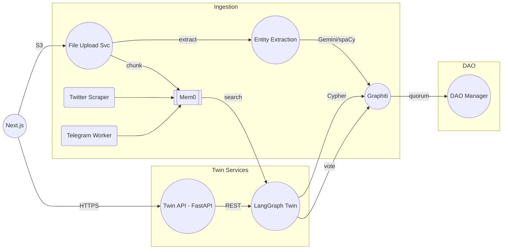

# Frontier Tower Digital‑Twin & DAO Coordination

Build a Python prototype that turns each user's heterogeneous footprint — personal docs, chats, votes, socials - into a Digital Twin able to:
1. Answer questions and give recommendations in the user's voice.
2. Take actions like casting votes inside an autonomous organization (e.g., a robot‑run 3‑D‑printing micro‑factory) while coordinating with up to 99 other twins through a multi‑agent planner.

This is the backend PRD. This backend (1) builds per‑member digital twins with persistent memory (Mem0) and (2) maintains a shared temporal knowledge graph of proposals, votes, and policies (Graphiti).
The web front‑end will be a thin Next.js layer that calls these back‑end APIs.

---

## Executive Summary

Build a backend that:
1. **Creates per‑member digital twins** with persistent memory in **Mem0**
2. **Maintains a shared temporal knowledge graph** (policies, proposals, votes) in **Graphiti**
3. Exposes REST / SSE endpoints a simple Next.js front‑end can consume.

## 1 | Goals & Success Metrics

| Goal | KPI | Target |
|------|-----|--------|
| Twins recall user preferences | Eval success rate | ≥ 90 % |
| Vote → DAO‑resolution latency | Minutes | < 2 min |
| Retrieval P95 (Mem0 + Graphiti) | ms | < 200 ms |
| Dev on‑boarding | Hours | < 2 h |
| Entity extraction accuracy | NER F1-score | ≥ 85% |

## Scope (MVP)

### 2.1 Ingestion
* **Files** (PDF/MD/TXT ≤ 20 MB)
* **Twitter** one‑shot scraper
* **Telegram** group‑chat poll every 5 min
* **Entity extraction** using Google Gemini API (with spaCy fallback)

### 2.2 Memory
* **Mem0 Cloud** per user (`user_id` namespace)
* Metadata: `domain, source, importance, session_id, turn, created_at, expiration_date?`

### 2.3 Knowledge Graph
* **Graphiti** (https://help.getzep.com/graphiti/graphiti/overview) with temporal edges for proposals, votes, policies, chat‑events
* Backed by **Neo4j** 5.26+ for graph storage and queries

### 2.4 Digital‑Twin Agent
* LangGraph + OpenAI GPT‑4o
* Retrieval plan:
  1. Mem0 `search()` (personal)
  2. Graphiti Cypher (shared)
  3. Last‑6 raw messages from Postgres

#### Twin Personalization Strategy
* **Personality Extraction**: Extract writing style, preferences, and decision patterns during ingestion
* **Voice Profile**: Store a dedicated profile in Mem0 with highest importance flags (never expires)
* **Calibration Phase**: Allow users to rate twin responses for voice accuracy (initial setup)
* **Stylometric Analysis**: Extract features like sentence length, vocabulary diversity, and formatting preferences
* **Adaptive Prompting**: Dynamically adjust LLM prompts to incorporate voice characteristics

### 2.5 DAO Manager
* Cron every 60 s; closes proposals & writes `(:DAOResolution)`

### 2.6 Frontend (stub)
* File‑upload area
* Policy / proposal list
* "Personal wiki" page (Mem0 summary endpoint)
* Chat UI (SSE)

### User stories (condensed)

User - upload docs & tweets	-> my twin learns my preferences
Member - chat with my twin -> refine its memory & get advice
Twin agent - read shared wiki & proposals -> recommend votes
DAO admin - view resolution dashboard -> track consensus in real time

## Tech stack

### ⚙️ Full End‑to‑End Tech Stack (MVP)

| Layer | Component | Version / Notes |
|-------|-----------|-----------------|
| **Languages** | Python 3.12 (LTS), TypeScript 5.x | — |
| **Frontend** | Next.js 14 · React 18 · TailwindCSS · shadcn/ui · SWR | Chat over **SSE** |
| **Auth** | Auth0 (Universal Login) | JWT bearer tokens |
| **API Gateway** | **FastAPI** + Uvicorn workers (Docker) | REST + SSE |
| **Task Queue** | Celery 5 · Redis 7 (Elasticache) | Ingestion & async Mem0 writes |
| **LLM & Agents** | OpenAI GPT‑4o (`openai` 1.x) | LangGraph ≥ 0.3 |
| **Memory (per user)** | **Mem0 Cloud** (`mem0ai` Python SDK) | Vector store = Qdrant (managed) |
| **Chat‑log store** | Postgres 15 (`chat_message` table) | Point‑in‑time recovery |
| **Knowledge Graph (shared)** | **Graphiti** (`graphiti-core` Python SDK) | Backed by Neo4j 5.26+ |
| **Graph Database** | **Neo4j** 5.26 Community | Storage backend for Graphiti |
| **Entity Extraction** | **Google Gemini API** (primary) · spaCy (fallback) | NER with 18+ entity types |
| **Blob Storage** | Wasabi | Only for large file uploads |
| **Scraping / ETL** | Tweepy (Twitter) · Telethon (Telegram) · pdfminer.six | Chunking with `tiktoken` |
| **Background Jobs** | Prefect 2 (optional orchestration) | Twitter/TG pulls, nightly summariser |
| **Containerisation** | Docker · docker‑compose (local) · Amazon ECS Fargate (prod) | — |
| **CI/CD** | GitHub Actions | Build, test, push images, Terraform plan/apply |
| **Observability** | Prometheus + Grafana · Sentry (Python & JS SDKs) · AWS CloudWatch | Metrics, tracing, error reporting |
| **Testing** | Pytest · React Testing Library · Locust (load) | — |
| **Security** | AWS KMS‑encrypted secrets (SSM Parameter Store), TLS 1.3, OWASP headers via nginx | — |
| **Local Dev** | devcontainer / Docker Desktop · Makefile · direnv for `.env` | — |


## Data‑Storage Strategy

| Data | Store | Rationale |
|------|-------|-----------|
| **Raw chat turns** | **Postgres** table `chat_message`<br>`(session_id, sender, ts, content)` | Ordered audit trail, cheap row storage, GDPR export |
| **Semantic/episodic facts** distilled from chat | **Mem0** `add()` with `domain="chat"` | Vector recall; keep prompts lean |
| **Session summaries** | Mem0 with higher `importance` | Fast context refresh |
| **Interaction edges** | **Graphiti** `(:DigitalTwin)-[:CHATTED {ts}]→(:User)` | Analytics ("inactive users") |
| **File blobs** | S3/Wasabi (only if attachments arrive later) | Binary data not suitable for Mem0 |

Nightly task trims low‑importance Mem0 chat vectors after 90 days while keeping raw logs in Postgres indefinitely.

### Data Consistency Strategy

| Mechanism | Description | Implementation |
|-----------|-------------|----------------|
| **Transaction IDs** | Unique IDs across all data stores | Include in all operations for tracking lineage |
| **CDC Pipeline** | Change Data Capture between stores | Celery tasks with retries for Postgres → Mem0/Graphiti |
| **Reconciliation Service** | Hourly check of data consistency | Verifies critical data exists across all systems |
| **Distributed Locks** | Prevent concurrent updates | Redis-based locks for multi-store transactions |
| **Idempotent Operations** | Safe to retry on failure | All write operations designed for safe reapplication |

---

## Functional Requirements

### 4.1 File & Text Ingestion
- Accept files ≤ 20 MB (PDF/TXT/MD).
- Chunk to ≤ 2 k tokens
- `add_batch()` to Mem0 with `domain="doc"` and `byte_range`
- Scrapers must deduplicate via doc hash.
- Extract entities using Google Gemini API (with spaCy as fallback)

### 4.2 Chat Pipeline
1. **POST /twin/{uid}/chat**
2. Insert turn into `chat_message`
3. Enqueue Mem0 upsert (Celery) with low importance + 90‑day TTL
4. Fetch context:
   * Last 6 raw messages (Postgres)
   * Top 5 Mem0 memories
   * ± 5 Graphiti facts
5. Stream GPT‑4o response; store assistant turn via same path.

### 4.3 Graphiti Model (temporal)

Entities:
```
(:User {id, handle})
(:DigitalTwin {id})
(:Proposal {id, title, status})
(:Vote {choice, confidence, ts})
(:PolicyTopic {id, title})
(:Document {id, filename})
```

Relations:
```
(:User)-[:HAS_TWIN]->(:DigitalTwin)
(:DigitalTwin)-[:VOTED {ts}]->(:Vote)-[:ON]->(:Proposal)
(:User)-[:AUTHORED {ts}]->(:Document)
(:Document)-[:MENTIONS]->(:PolicyTopic)
```

### 4.4 Twin agent

Exposes /twin/{user_id}/chat (stream).
Retrieval plan:
- mem0.search(user_msg, limit=5)
- graphiti.search(user_msg, time_window=90d, limit=5)

Prompt template appends both result sets.
Calls /vote when pattern matches "## VOTE:".

### 4.5 DAO manager

Cron every 60 s: MATCH (v:Vote)<-[:VOTED]-() WHERE v.open = true → compute quorum.

When quorum met: create (:DAOResolution {id, status:'passed'}) and set Proposal.status='closed'.

#### DAO Resolution Logic (Extended)
* **Quorum Requirements**: 60% participation required for valid resolution
* **Vote Threshold**: 66% majority needed for proposal to pass
* **Time-boxing**: Proposals automatically close after 72 hours
* **Proposal States**: Draft → Open → Voting → Passed/Failed → Implemented
* **Vote Delegation**: Twins can receive delegated voting rights from inactive members
* **Weighted Voting**: Optional support for weighted votes based on configurable attributes

### 4.6 Error Handling Strategy
* **Error Taxonomy**:
  * `INGESTION_ERROR`: Failed data ingestion (retry with backoff)
  * `RETRIEVAL_ERROR`: Failed context retrieval (fallback to simpler context)
  * `LLM_ERROR`: Model unavailable (queue request, fallback to smaller model)
  * `VOTE_ERROR`: Failed vote recording (alert, retry, manual resolution path)
  * `SYNC_ERROR`: Data consistency failure (reconciliation job, alert)
  * `NER_ERROR`: Entity extraction failure (retry with fallback extractor)

* **Recovery Mechanisms**:
  * Dead-letter queues for failed ingestion tasks
  * Circuit breakers for external dependencies (OpenAI, Mem0, Gemini)
  * Automatic proposal unblocking for stalled voting processes
  * Graceful degradation paths for all critical services
  * Automatic fallback to spaCy if Gemini API is unavailable

### 4.7 Monitoring and Evaluation
* **Twin Accuracy Test Suite**: Golden dataset of user preferences to evaluate recall performance
* **Periodic Self-evaluation**: Twins periodically test themselves against known user data
* **Entity Extraction Evaluation**: Benchmarking tool comparing Gemini vs spaCy extraction quality
* **Key Dashboards**:
  * Response latency (P50, P95, P99)
  * Preference recall accuracy (against test suite)
  * Vote alignment (% match between user and twin votes when both exist)
  * Entity extraction accuracy (F1 scores by entity type)
  * System health (service availability, error rates)
* **Anomaly Detection**: Alert on unexpected twin behavior or preference drift
* **Usage Metrics**: Track user engagement, twin utilization, and feature adoption

### Technical Architecture



Rationale
- Use Celery + Redis as ingestion bus; duplicate‑free, retryable.
- Graphiti integration via Python SDK with Neo4j backend.
- Mem0 Cloud for vectors + Postgres row store.
- Chat streaming via Server‑Sent Events (SSE) for simplicity.
- Google Gemini API for high-quality entity extraction with spaCy fallback.

### API outline (FastAPI)

```python
POST /upload                # multipart -> S3 presigned -> enqueue ingest
GET  /twin/{uid}/profile    # return Mem0 summary + vector stats
POST /twin/{uid}/chat       # {message} -> stream response
GET  /proposals/open        # list active proposals
GET  /proposals/{pid}/status
```

### Implementation plan

1. Local Dev Env Setup
2. Minimal Infra Bootstrap (Postgres, Mem0 access, Graphiti instance)
3. Mem0 Wrapper Lib (MemoryService)
4. Graphiti Basic Setup & GraphitiService Wrapper
5. **PoC: Basic LangGraph Agent (Retrieval Only - Mem0 + Graphiti)**

After we have the PoC:
6. File Upload Service + Basic Ingestion Worker
  - Mem0 only first - we'll use files in `data` directory for now, we won't add the S3/Wasabi flow until the end of this MVP
7. Basic Chat API (/twin/{uid}/chat - POST only, no streaming yet)integrating the PoC Agent
8. Refine Ingestion (add Graphiti sync, dual entity extraction with Gemini/spaCy, chunking, deduplication)
9. Implement Chat Streaming (SSE)
10. Voting Intent Parsing & /vote Endpoint
11. DAO Manager Cron + Quorum Logic
12. Add Twitter & Telegram Ingestion
13. Build Frontend Stubs & Auth Integration
14. Full Infra Provisioning (IaC refinement)
15. CI/CD Setup & Testing Enhancements
